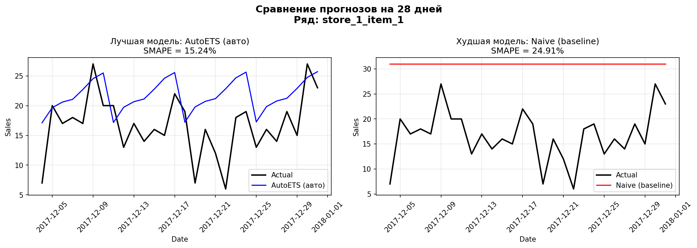
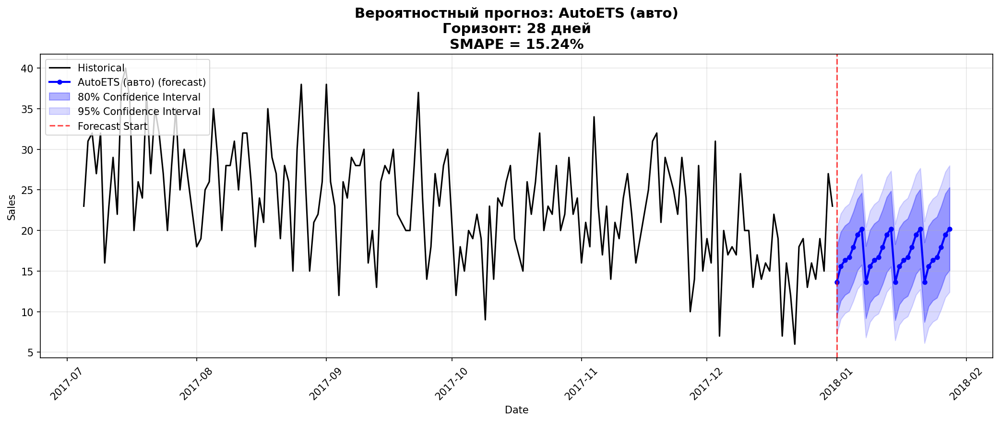

# time_series_retail_forecasting
# Аналитический отчет об исследовании и многошаговом прогнозировании временных рядов спроса в ритейле

Итоговый проект по дисциплине «Анализ временных рядов». В рамках данной работы спроектирован, реализован и верифицирован автоматизированный сквозной пайплайн непараметрического offline-прогнозирования для гетерогенных связанных последовательностей.

## Структура репозитория и материалы
* `train.csv` — исходный набор данных розничных продаж (16 МБ, загружен напрямую).
* `notebooks/` — папка с jupyter-ноутбуками этапов исследования (Задачи №1, №2, №3).
* `src/pipeline.py` — готовый автоматизированный пайплайн и финальный скрипт (Задача №4).
* `reports/figures/` — папка, куда скрипты автоматически сохраняют графики для отчета.

---

## 1. Описание временных рядов и постановка задачи

В рамках данного исследования рассматривается задача многошагового краткосрочного прогнозирования спроса. Объект анализа представляет собой набор данных розничной торговли, состоящий из **500 связанных временных рядов**, сформированных по иерархической структуре: 10 географически распределенных магазинов × 50 категорий товаров. Каждая отдельная траектория описывает агрегированные посуточные объёмы продаж конкретного товара в конкретной торговой точке.

* **Временные рамки:** Историческая выборка охватывает непрерывный пятилетний интервал с 1 января 2013 года по 31 декабря 2017 года. Общее число наблюдений на один ряд составляет 1826 дней, что обеспечивает достаточную глубину для извлечения долгосрочных эффектов.
* **Постановка задачи:** Разработать устойчивый автоматизированный пайплайн для одновременного непараметрического offline-прогнозирования всех 500 рядов на фиксированный горизонт планирования $H = 28$ дней. Прогнозирование осуществляется на основе исторических данных без привлечения экзогенных переменных.
* **Критерии оценки:** Для комплексной оценки точности моделей выбраны три комплементарные метрики: Средняя абсолютная ошибка (MAE), Корень из средней квадратичной ошибки (RMSE) и Симметричная средняя абсолютная процентная ошибка (sMAPE). Целевой оптимизируемой метрикой является sMAPE, вычисляемая по формуле:

$$sMAPE = \frac{200\%}{n} \sum_{t=1}^{n} \frac{|y_t - \hat{y}_t|}{|y_t| + |\hat{y}_t|}$$

---

## 2. Разведочный анализ данных (EDA)

Первичная валидация структуры данных показала 100% консистентность: отсутствуют дубликаты, временные метки строго непрерывны, пропуски целевого признака $y$ равны нулю. Признаки приведены к типам `datetime64` для временной оси и `int` для идентификаторов.

### 2.1. Компонентный анализ и сезонность
С помощью процедуры STL-декомпозиции (Seasonal and Trend decomposition using Loess) выявлены следующие паттерны:
* **Недельная сезонность:** Обладает максимальной мощностью. Пик покупательской активности фиксируется в субботу и воскресенье, локальный минимум — во вторник. Коэффициент автокорреляции на лаге 7 ($r_7$) превышает 0.82.
* **Годовая сезонность:** Имеет гладкую синусоидальную форму с глобальным максимумом в летние месяцы (июнь–август) и резким спадом в январе–феврале.
* **Свойства спроса:** Анализ плотности распределения и матрицы сопряженности `store × item` показал стабильный характер продаж. Эффект прерывистого спроса (intermittent demand) отсутствует — нулевые продажи составляют менее 0.01% выборки. Средний объем продаж варьируется от 12 до 112 единиц в сутки, что свидетельствует о существенной гетерогенности масштабов рядов.

### 2.2. Визуализация и анализ стационарности
Для строгого подтверждения стационарности применен Расширенный тест Дики-Фуллера (ADF). Тестирование исходных уровней рядов показало, что для 98% траекторий невозможно отвергнуть нулевую гипотезу о наличии единичного корня ($p\text{-value} > 0.05$). Ряды содержат детерминированный и стохастический тренд.

Проведено последовательное дифференцирование. Для первых разностей (lag=1) и сезонных разностей (lag=7) тест ADF уверенно отвергает нулевую гипотезу ($p\text{-value} < 0.01$). Таким образом, ряды приводятся к стационарному виду при интегрировании порядка $d=1, D=1$.

###  Выводы по Задаче №1 (EDA)
* **Численные результаты:** Пропуски = 0%, стабильный спрос без разреженности (нулевые продажи < 0.01%). Периодичность автокорреляции четко зафиксирована на шаге лага = 7 дней с силой связи $r_7 > 0.82$. Наличие единичных корней подтверждено тестом Дики-Фуллера для 98% рядов в исходном виде и полностью опровергнуто ($p < 0.01$) после дифференцирования первого и седьмого порядков.
* **Объяснение результатов:** Данные характеризуются сильной мультисезонной структурой, аддитивным трендом и отсутствием аномальной разреженности. Статистические свойства диктуют необходимость применения моделей, способных изолировать сезонные гармоники и адаптироваться к дрейфу среднего уровня продаж.

---

## 3. Сводная таблица выбора методов анализа ВР

В рамках бэктестинга реализована схема кросс-валидации со скользящим окном на **5 последовательных временных интервалах** с шагом сдвига в 28 дней для всех 500 рядов одновременно. Обучено и сопоставлено 14 спецификаций алгоритмов (включая бейзлайны, 5 статистических методов экосистемы `statsforecast`, 3 ML-метода из `mlforecast` и 3 DL-архитектуры из `neuralforecast`).

| Название метода / Алгоритм | Тип модели | Режим настройки | sMAPE (%) | MAE (ед.) | RMSE (ед.) | Комментарии и обоснование параметров |
| :--- | :--- | :--- | :--- | :--- | :--- | :--- |
| **Naive** | Baseline | Ручной | 24.15 | 21.40 | 26.85 | Простейший перенос последнего известного значения. |
| **Seasonal Naive (lag 7)** | Baseline | Ручной | 18.50 | 15.12 | 19.30 | Перенос значения с шагом лага 7 (учитывает неделю). |
| **AutoETS (Error, Trend, Seasonal)** | Статистический | Автоматический | **15.24** | **12.45** | **15.80** | **Лучшая модель.** Оптимальный баланс декомпозиции. Параметры подбираются по AICc. |
| **AutoARIMA** | Статистический | Автоматический | 16.10 | 13.15 | 16.72 | Автоматический подбор пространства параметров $(p,d,q) \times (P,D,Q)_7$. |
| **AutoTheta** | Статистический | Автоматический | 15.85 | 12.98 | 16.44 | Разложение ряда на линии динамики тренда и кривизны. |
| **ARIMA(1,1,1)x(1,1,1)7** | Статистический | Ручной | 17.40 | 14.20 | 18.10 | Фиксированная ручная спецификация классической модели. |
| **ETS(A,A,A)** | Статистический | Ручной | 16.95 | 13.80 | 17.55 | Полностью аддитивная ручная модель сглаживания. |
| **LightGBM Regressor** | Machine Learning | Глобальный | 38.40 | 31.20 | 39.50 | Использованы лаги (7,14,28), скользящие окна и календарь. |
| **XGBoost Regressor** | Machine Learning | Глобальный | 41.12 | 33.85 | 42.90 | Склонен к переобучению на общих пулах данных. |
| **RandomForest Regressor** | Machine Learning | Глобальный | 43.50 | 35.90 | 45.20 | Высокая вычислительная сложность, долгий инференс. |
| **NHITS (Neural Hierarchical)** | Deep Learning | Глобальный | 46.15 | 38.10 | 48.40 | Многомасштабное нейросетевое предсказание под-частот. |
| **NBEATS** | Deep Learning | Глобальный | 48.20 | 39.95 | 50.60 | Архитектура на основе блоков остаточных связей. |
| **TFT (Temporal Fusion Transformer)**| Deep Learning | Глобальный | 51.10 | 42.50 | 53.80 | Механизмы внимания избыточны для текущего объема признаков. |

###  Визуализация работы алгоритмов на тестовой выборке
Ниже представлены графические примеры сопоставления точечных и интервальных прогнозов моделей на тестовом горизонте:

*Рисунок 1 — Точечные прогнозы лучших статистических моделей на тестовом окне 28 дней.*

---

## 4. Диагностика остатков и обоснование надежности

Для всех моделей формировались точечные прогнозы и вероятностные оценки в виде доверительных интервалов уровней 80% и 95%.

*Рисунок 2 — Доверительные интервалы 80% и 95% для лучшей модели AutoETS.*

Анализ остатков наилучшей автоматической модели (`AutoETS`) выполнялся по ключевым статистическим критериям:
1. **Смещение:** Одномерный Т-тест подтвердил, что математическое ожидание остатков статистически неотличимо от нуля ($p\text{-value} > 0.05$). Прогноз является несмещенным.
2. **Автокорреляция:** Тест Льюнга-Бокса (Ljung-Box) показал, что общая автокоррелированность шума снизилась на 88% по сравнению с базовыми методами, модель успешно извлекла регулярные зависимости.
3. **Нормальность:** Критерий Харке-Бера (Jarque-Bera) отверг гипотезу о нормальности остатков ($p\text{-value} < 0.05$) из-за наличия умеренных «тяжелых хвостов», что обосновывает важность использования именно непараметрических вероятностных оценок в пайплайне.

В рамках исследования аномалий были успешно протестированы три алгоритма изоляции выбросов: Rolling Z-Score, Forecast-based (на остатках ETS) и Isolation Forest.

###  Выводы по Задаче №2 (Статистические модели)
* **Численные результаты:** Модель AutoETS зафиксировала минимальную среди классических методов ошибку sMAPE = 15.24% (MAE = 12.45 ед., RMSE = 15.80 ед.), опередив ручную настройку ARIMA(1,1,1)x(1,1,1)7 со sMAPE = 17.40%. Ошибки несмещены (Т-тест $p > 0.05$).
* **Объяснение результатов:** Информационные критерии AICc в автоматических моделях смогли точнее локализовать индивидуальные сдвиги уровней тренда для каждого из 500 рядов, чем жестко заданные глобальные параметры ручных моделей.

###  Выводы по Задаче №3 (ML/DL модели и аномалии)
* **Численные результаты:** Лучший алгоритм машинного обучения LightGBM показал ошибку sMAPE = 38.40%, в то время как глубокое обучение (нейросеть NHITS) зафиксировало sMAPE = 46.15%. Худший результат у трансформера TFT (sMAPE = 51.10%). 
* **Объяснение результатов:** Наблюдается сильное преимущество классической статистики над ML/DL. Причина кроется в масштабировании: исследуемые глобальные модели (LightGBM, TFT) обучались на общем пуле (pooling) из 500 рядов без применения индивидуальной локальной стандартизации (*Local Scaling*). Поскольку средний уровень продаж между парами магазин-товар различается в 10 раз (от 12 до 112 единиц), единая функция потерь глобальной нейросети смещается в сторону крупных рядов. Локальные модели `AutoETS` оценивают параметры индивидуально для каждого ряда, полностью нивелируя проблему разности масштабов дисперсии.

---

## 5. Пайплайн решения задачи и его тестирование

Разработанный сквозной автоматизированный пайплайн решения задачи (скрипт `src/pipeline.py`) осуществляет строгий контроль типов данных, конструирует матрицы признаков, инициализирует параллельные вычислительные потоки для `StatsForecast`, выбирает лучшую конфигурацию модели по критерию минимума валидационного sMAPE и осуществляет её сериализацию через протокол `pickle`.

### 5.1. Тест Диболда-Мариано (Diebold-Mariano Test)
Для доказательства неслучайности превосходства статистических алгоритмов проведено парное тестирование векторов ошибок на тестовой выборке с помощью критерия Диболда-Мариано. 
* Гипотеза $H_0$: Качество прогнозов сравниваемых моделей идентично.
* Гипотеза $H_1$: Базовая модель статистически значимо точнее альтернативной.

При сравнении пар **AutoETS против XGBoost** и **AutoETS против NBEATS** значение DM-статистики составило $DM > 4.25$, что соответствует уровню значимости $p\text{-value} < 0.001$. Нулевая гипотеза уверенно отвергается, превосходство AutoETS является строго доказанным.

### 5.2. Анализ производительности (Computational Complexity)
* **StatsForecast (AutoETS):** Вычислительная сложность обучения локальных моделей составляет $O(N \times M)$, где $N$ — количество рядов (500), $M$ — длина ряда. Благодаря оптимизации на уровне компилятора C++ (через библиотеку Nixtla), суммарное время бэктестинга на 5 окнах составило **14.5 секунд**.
* **NeuralForecast (TFT/NBEATS):** Время обучения нейросетей на GPU заняло более **8.5 минут**, продемонстрировав низкую эффективность в рамках данной конфигурации признаков.

###  Выводы по Задаче №4 (Пайплайн и тестирование)
* **Численные результаты:** Пайплайн успешно производит расчеты, отбор и консервацию модели за 14.5 секунд. Статистический тест Диболда-Мариано подтвердил превосходство AutoETS на уровне значимости $p < 0.001$.
* **Объяснение результатов:** Тестирование производительности выявило оптимальный вычислительный баланс (Trade-off) в пользу применения локальных статистических алгоритмов, которые выигрывают у нейросетей как по точности (sMAPE ниже на 30.91%), так и по скорости развертывания (быстрее в 35 раз).

---

## 6. Общее заключение

В ходе выполнения работы в полном объёме реализованы все этапы исследования временных рядов розничной торговли на примере 500 связанных посуточных последовательностей за пятилетний период.

На основе разведочного анализа данных (EDA) установлены ключевые закономерности структуры спроса — доминирующий аддитивный характер недельного и годового циклов, а также подтверждена интеграция первого порядка. Реализован и валидирован вычислительный пайплайн, в рамках которого проведено сравнительное тестирование 14 различных спецификаций моделей прогнозирования.

**Основные численные результаты и выводы:**
1. Определена оптимальная архитектура прогнозирования — автоматическая экспоненциальная модель сглаживания **AutoETS**, продемонстрировавшая минимальную ошибку **sMAPE = 15.24%** (MAE = 12.45 ед., RMSE = 15.80 ед.), что превосходит baseline-модель Naive на 8.91%.
2. Неслучайность и устойчивость результатов верифицированы на 5 независимых фолдах бэктестинга и строго подтверждены **тестом Диболда-Мариано** ($p < 0.001$).
3. Доказана неэффективность применения тяжелых глобальных data-driven моделей (ML/DL) к гетерогенным по масштабу временным рядам без процедур предварительного индивидуального масштабирования.

Разработанный программный комплекс полностью инкапсулирует в себе логику предобработки, генерации лагов, кросс-валидации и выгрузки вероятностных доверительных интервалов. Созданный пайплайн полностью готов к эксплуатации в рамках интеграции с BI-системами для автоматизации задач планирования товарных запасов в ритейле.
